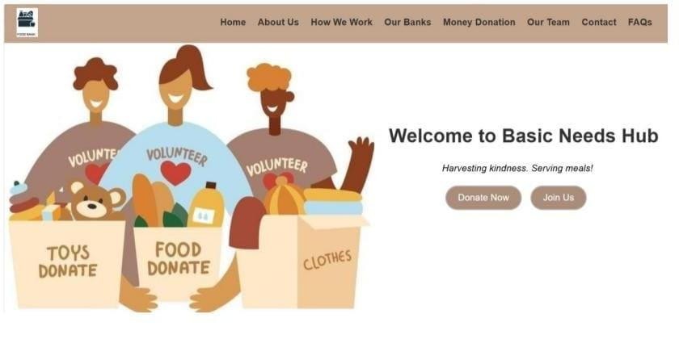

# Basic Needs Hub

## 📷 Homepage Screenshot



---

## 🛍️ About Basic Needs Hub

Basic Needs Hub is a web platform that connects donors with those in need. It enables users to donate money and food to help reduce hunger and support local communities.

---

## 🌟 Features

- 💰 Donate money to trusted causes  
- 🍱 Donate food items to people in need  
- 🗺️ Location-based donation centers  
- 🔐 Simple and user-friendly interface  

---

## 🔧 Tech Stack

- **Frontend:** HTML, CSS, JavaScript  
  *(Update if using ReactJS or other frameworks)*  
- **Backend:** Not applicable (static site) / Node.js / Flask *(update if any)*  
- **Database:** N/A or specify (Firebase, MongoDB, etc.)  
- **Hosting:** GitHub Pages / Vercel / Netlify *(update accordingly)*  

---

## 🚀 Getting Started

To run this project locally, follow these steps:

```bash
git clone https://github.com/your-username/basic-needs-hub.git
cd basic-needs-hub
open index.html  # or run with Live Server if using VSCode
